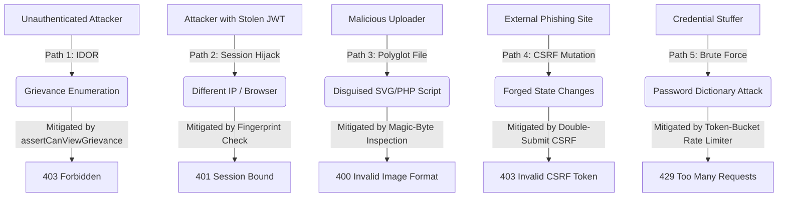

# Threat Model & Attack Surface Analysis

## 1. Assets of Value

| Asset | Description | Sensitivity | Impact of Compromise |
| :--- | :--- | :--- | :--- |
| **Grievance Records** | Titles, descriptions, room numbers, and timeline of hostel student issues. | High (Confidentiality) | PII leakage, harassment, reputational damage to students. |
| **Media Attachments** | Photographic evidence submitted by students (room damage, mess food, facility conditions). | High (Confidentiality & Integrity) | Exposure of private living quarters; risk of arbitrary file upload/malware distribution. |
| **User Credentials** | Passwords, password hashes (scrypt), email addresses, and room assignments. | Critical (Confidentiality & Integrity) | Complete account takeover across student, warden, or admin roles. |
| **Authentication Tokens** | Active JWT access tokens, rotating refresh tokens, and CSRF tokens. | Critical (Integrity) | Session hijacking, impersonation, bypass of MFA/login boundaries. |
| **Administrative Controls** | Warden provisioning, user password reset, and account deletion endpoints. | Critical (Availability & Integrity) | System-wide privilege escalation, disruption of grievance resolution operations. |

---

## 2. Threat Actors & Motivations

1. **Unauthenticated Internet Attacker**: External actor probing public endpoints for exposed routes, brute-forcing login/signup forms, attempting DDoS attacks, or exploiting dependency vulnerabilities.
2. **Authenticated Student (Benign & Malicious)**: Legitimate student seeking to view peers' complaints (horizontal privilege escalation), modify resolved tickets, tamper with grievance statuses, or spam comment sections.
3. **Compromised Student Account**: External adversary wielding stolen student credentials to exfiltrate hostel records or upload malicious file payloads.
4. **Authenticated Warden (Benign & Malicious)**: Facility staff member who should only manage assigned student grievances, but could attempt privilege escalation to admin operations or unauthorized data deletion.
5. **Compromised Warden Account**: High-value target for attackers attempting to tamper with institutional compliance logs or disable student accounts.
6. **Malicious Uploader**: Actor seeking to upload HTML/SVG/PHP files disguised as images to trigger Stored Cross-Site Scripting (XSS) or Remote Code Execution (RCE).
7. **Direct API Attacker**: Adversary calling REST endpoints directly via scripts/Postman, bypassing client-side validation, UI disabled states, and frontend route guards.

---

## 3. Trust Boundaries & Data Flow

```
                      [ Untrusted Internet ]
                                 │
                                 ▼ (Port 80/443: TLS & Rate Limit)
                      ┌─────────────────────┐
                      │  Nginx Reverse Proxy │ ── (DDoS Limit: 10r/s API, 30r/s Global)
                      └─────────────────────┘
                                 │
                 ┌───────────────┴───────────────┐
                 ▼ (Port 3000)                   ▼ (Port 3001)
     ┌───────────────────────┐       ┌─────────────────────────────────┐
     │ SvelteKit Frontend UI │       │       Hono Backend API          │
     └───────────────────────┘       └─────────────────────────────────┘
                                                     │
               ┌──────────────────────┬──────────────┴────────────────┬──────────────────────┐
               ▼                      ▼                               ▼                      ▼
    ┌────────────────────┐ ┌────────────────────┐          ┌────────────────────┐ ┌────────────────────┐
    │  Auth & CSRF Layer │ │ Input & MIME Guard │          │     Prisma ORM     │ │ Cloudinary / Disk  │
    │  (JWT/Scrypt/Fpt)  │ │ (Magic-Byte Checks)│          │ (Param. Queries)   │ │ (Sanitized Names)  │
    └────────────────────┘ └────────────────────┘          └────────────────────┘ └────────────────────┘
               │                      │                               │                      │
               ▼                      ▼                               ▼                      ▼
    ┌────────────────────┐ ┌────────────────────┐          ┌────────────────────┐ ┌────────────────────┐
    │ Redis Rate Limiter │ │ Route Guards (RBAC)│          │ PostgreSQL (Neon)  │ │   Media Storage    │
    └────────────────────┘ └────────────────────┘          └────────────────────┘ └────────────────────┘
```

### Trust Boundary Matrix

| Boundary | Transition | Validations Enforced | Threats Mitigated |
| :--- | :--- | :--- | :--- |
| **TB-1: Client ➔ Nginx** | Public Internet to Reverse Proxy | Body size limit (3MB), IP rate limits (10r/s API, 30r/s global), security headers. | Layer-7 DDoS, request flooding, clickjacking, MIME sniffing. |
| **TB-2: Nginx ➔ Hono API** | Reverse Proxy to Backend API | CORS origin verification, real client IP extraction (`X-Forwarded-For`), CSRF token check. | Cross-Origin abuse, forged state mutations, IP spoofing. |
| **TB-3: Request ➔ Auth Middleware** | Route Handler to Identity Context | JWT signature verification (`HS256`), expiry check (15m), JTI blacklist lookup, token version matching, IP/UA fingerprint match. | Token forgery, replay attacks, session hijacking, stale session reuse. |
| **TB-4: Handler ➔ Authorization** | Controller to Business Logic | `assertCanViewGrievance(user, resource)`, role-level access checks (`admin`, `warden`, `student`). | Horizontal Privilege Escalation (IDOR), Vertical Privilege Escalation. |
| **TB-5: Handler ➔ Storage** | API to File Storage (Cloudinary/Disk) | Magic-byte MIME detection (JPEG/PNG/GIF/WebP only), 2MB size cap, randomized filenames. | Polyglot file attacks, stored XSS, disk exhaustion, path traversal. |
| **TB-6: API ➔ PostgreSQL** | Backend to Database | Prisma ORM parameterized queries, transaction isolation, scrypt password hashing. | SQL Injection, data corruption, database credential cracking. |

---

## 4. Attack Surface & Endpoint Inventory

| Method | Endpoint Path | Authentication | Authorization | Rate Limit | Primary Security Controls |
| :--- | :--- | :--- | :--- | :--- | :--- |
| `GET` | `/api/csrf` | Public | None | Standard | Cryptographic double-submit token generation |
| `POST` | `/api/signup` | Public | None | 5 req / 50s (IP) | Institutional email (`@giet.edu`), scrypt hash |
| `POST` | `/api/login` | Public | None | 5 req / 50s (IP) | IP/UA fingerprint binding, token issuance |
| `POST` | `/api/refresh` | Cookie / Header | Any Valid Refresh Token | Standard | Refresh token rotation, revocation check |
| `POST` | `/api/logout` | Cookie / Header | Authenticated User | Standard | JTI added to `TokenBlacklist` table |
| `GET` | `/api/me` | Cookie / Header | Authenticated User | Standard | Session validation, profile retrieval |
| `GET` | `/api/health` | Public | None | Standard | Database responsiveness liveness probe |
| `GET` | `/api/grievances` | Cookie / Header | Student / Warden / Admin | Standard | Scoped query: Students see own, Wardens see all |
| `POST` | `/api/grievances` | Cookie / Header | Student | Standard | CSRF check, 120-char title / 3000-char desc limits |
| `GET` | `/api/grievances/:id` | Cookie / Header | Owner or Warden/Admin | Standard | Server-side IDOR ownership check |
| `PATCH` | `/api/grievances/:id` | Cookie / Header | Owner (edit) / Warden (status) | Standard | Role check: Students cannot change status |
| `GET` | `/api/grievances/:id/comments` | Cookie / Header | Owner or Warden/Admin | Standard | Grievance view authorization required |
| `POST` | `/api/grievances/:id/comments` | Cookie / Header | Owner or Warden/Admin | Standard | CSRF check, 2000-char comment body limit |
| `POST` | `/api/grievances/:id/attachments`| Cookie / Header | Owner | Standard | Magic-byte MIME detection, 2MB size limit |
| `GET` | `/api/attachments/:id` | Cookie / Header | Owner or Warden/Admin | Standard | IDOR check on parent grievance record |
| `GET` | `/api/admin/users` | Cookie / Header | Admin Only | Standard | Password hashes stripped from payload |
| `GET` | `/api/admin/wardens` | Cookie / Header | Admin Only | Standard | Admin-only role guard |
| `POST` | `/api/admin/wardens` | Cookie / Header | Admin Only | 5 req / 50s (IP) | `@giet.edu` email validation, scrypt hashing |
| `PATCH` | `/api/admin/password` | Cookie / Header | Admin Only | 5 req / 50s (User) | Current password verification, token version bump |
| `PATCH` | `/api/admin/users/:id/password` | Cookie / Header | Admin Only | Standard | Warden password reset, revokes all warden sessions |
| `DELETE` | `/api/admin/users/:id` | Cookie / Header | Admin Only | Standard | Self-deletion protection, cascade cleanup |

---

## 5. Key Attack Paths & Blast Radius Analysis



### Attack Path 1: Horizontal Privilege Escalation via Grievance ID Enumeration
- **Attack Chain**: `Unauthenticated Attacker` ➔ Creates Student Account (`stu-1`) ➔ Receives Session ➔ Submits `GET /api/grievances/GRV-0003` (owned by Student `stu-2`) ➔ Attempts to inspect private maintenance complaints and room numbers.
- **Blast Radius If Unmitigated**: High. Any student could harvest confidential complaints and room details of all campus residents.
- **Current Defense**: `assertCanViewGrievance()` checks `user.id === grievance.studentId || ['warden', 'admin'].includes(user.role)`, immediately terminating unauthorized access with `403 Forbidden`.

### Attack Path 2: Malicious File Upload & Stored XSS / RCE
- **Attack Chain**: `Malicious Student` ➔ Bypasses frontend UI ➔ Issues `POST /api/grievances/GRV-0001/attachments` with a PHP/HTML script renamed to `photo.png` containing `<script>` or executable code.
- **Blast Radius If Unmitigated**: Critical. Stored XSS leading to session hijacking of Wardens or Remote Code Execution on server storage.
- **Current Defense**: `detectMimeFromBytes()` inspects the raw file buffer magic bytes. Non-matching files are rejected (`400 Bad Request`). Stored filenames are randomized using cryptographic 16-byte hex strings.

### Attack Path 3: Credential Stuffing & Brute Force on Authentication
- **Attack Chain**: `External Adversary` ➔ Automates thousands of requests to `POST /api/login` or `POST /api/signup` guessing passwords against known university email patterns.
- **Blast Radius If Unmitigated**: High. Account takeover across student or faculty accounts.
- **Current Defense**: Redis-backed Lua token-bucket limiter permits only 5 burst attempts with 0.1/s refill rate, returning `429 Too Many Requests` after quota exhaustion. Nginx proxy rate limits enforce an upstream 10r/s throttle.

### Attack Path 4: Cross-Site Request Forgery (CSRF) on Administrative Actions
- **Attack Chain**: `Adversary Site` ➔ Lures authenticated Warden or Admin to click a malicious link ➔ Triggers background `POST /api/admin/wardens` or `PATCH /api/grievances/:id` utilizing stored ambient cookies.
- **Blast Radius If Unmitigated**: Critical. Unauthorized creation of rogue warden accounts or falsification of complaint records.
- **Current Defense**: Double-submit CSRF cookie/header validation requires explicit `X-CSRF-Token` header for all unsafe HTTP methods when cookie authentication is present.

### Attack Path 5: Replay of Intercepted Access Tokens across Network Boundaries
- **Attack Chain**: `Adversary` ➔ Intercepts an active JWT access token from an insecure Wi-Fi hotspot ➔ Attempts to replay the token from the attacker's machine.
- **Blast Radius If Unmitigated**: High. Impersonation of the victim until token expiration.
- **Current Defense**: The token contains a cryptographic fingerprint `fpt = SHA-256(IP + User-Agent)`. The backend verifies matching client characteristics on every request, rejecting stolen tokens with `401 Unauthorized`.
